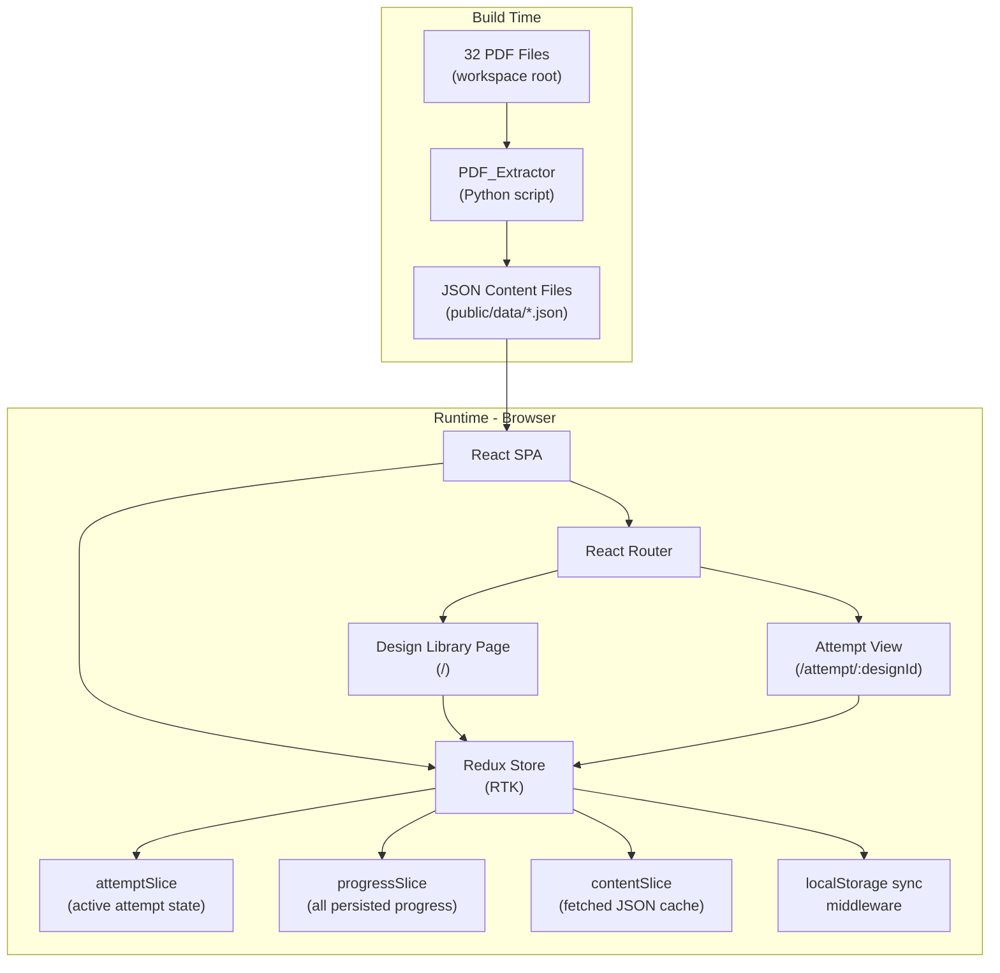

# Design Document: System Design Interview App

## Overview

The System Design Interview App is a React single-page application that helps candidates practice system design interviews through active recall. It presents 32 system design topics sourced from PDF files, guiding users through each topic section by section with answers hidden behind reveal buttons. Progress is persisted in browser localStorage so sessions can be resumed.

The architecture is split into two distinct phases:

1. **Build time**: A Python script (`PDF_Extractor`) reads each PDF and writes one structured JSON file per design into the React app's `public/` directory.
2. **Runtime**: The React SPA reads those static JSON files and renders the interactive study experience. No PDF parsing occurs in the browser.

This separation keeps the browser bundle small, eliminates runtime PDF dependencies, and makes the content trivially cacheable by a CDN or browser.

---

## Architecture



The build pipeline runs `extract_pdfs.py` before `npm run build`. The script writes files to `public/data/` so Vite/CRA includes them in the static output. At runtime, the app fetches `/data/<design-id>.json` on demand.

---

## Project Structure

```
/                              ← workspace root (PDF files live here)
├── extract_pdfs.py            ← PDF_Extractor script
├── requirements.txt           ← Python deps (pypdf, etc.)
│
└── app/                       ← React application root
    ├── package.json
    ├── vite.config.ts
    ├── public/
    │   └── data/              ← generated JSON files (gitignored or committed)
    │       ├── ads-click-aggregator.json
    │       ├── bitly.json
    │       └── ...            ← one file per design (32 total)
    │
    └── src/
        ├── main.tsx
        ├── App.tsx            ← router setup + Redux Provider
        │
        ├── types/
        │   └── design.ts      ← TypeScript interfaces for JSON schema
        │
        ├── pages/
        │   ├── LibraryPage.tsx
        │   └── AttemptPage.tsx
        │
        ├── components/
        │   ├── DesignCard.tsx
        │   ├── TopicView.tsx
        │   ├── QuestionReveal.tsx
        │   ├── ApproachCard.tsx
        │   └── ProgressBar.tsx
        │
        ├── store/
        │   ├── index.ts             ← configureStore, RootState, AppDispatch exports
        │   ├── attemptSlice.ts      ← active attempt state
        │   ├── progressSlice.ts     ← persisted progress for all designs
        │   ├── contentSlice.ts      ← fetched design JSON cache
        │   └── localStorageMiddleware.ts  ← syncs progressSlice to localStorage
        │
        └── hooks/
            ├── useDesignContent.ts  ← dispatches fetch thunk, selects from contentSlice
            └── useAttemptProgress.ts ← dispatches attemptSlice + progressSlice actions
```

---

## Components and Interfaces

### Page Components

**`LibraryPage`**
- Dispatches a `loadAllProgress` thunk on mount (reads all `sdia_progress_*` keys from localStorage and populates `progressSlice`).
- Fetches the design index (`/data/index.json`) via a `fetchIndex` thunk that populates `contentSlice`.
- Selects all designs and their progress via `useSelector` to determine button state per card.
- Renders a responsive grid of `DesignCard` components.
- Handles "Start Over" by dispatching `clearProgress(designId)` (which removes the key from localStorage via middleware) then navigating.

**`AttemptPage`**
- Receives `designId` from the URL param.
- Dispatches `fetchDesignContent(designId)` thunk on mount; selects the result from `contentSlice` via `useSelector`.
- Dispatches `initAttempt(designId)` on mount, which seeds `attemptSlice` from the matching entry in `progressSlice` (or creates a fresh attempt if none exists).
- Reads `currentStep`, `revealedTopics`, and `revealedQuestions` from `attemptSlice` via `useSelector`.
- Dispatches actions from `attemptSlice` on every reveal or navigation event; the `localStorageMiddleware` automatically syncs the updated progress to localStorage after each dispatch.
- Renders `TopicView` or `QuestionReveal` depending on the current topic type.

### Shared Components

**`DesignCard`**

```typescript
interface DesignCardProps {
  design: DesignSummary;       // { id, name }
  progress: AttemptProgress | null;
  onStart: () => void;
  onContinue: () => void;
  onStartOver: () => void;
}
```

Renders the card with conditional buttons based on whether `progress` is null (Start) or present (Continue + Start Over).

**`TopicView`**

```typescript
interface TopicViewProps {
  topic: StandardTopic;        // one of the 7 standard topics (incl. Design)
  revealed: boolean;
  onReveal: () => void;
}
```

Shows a prompt and "Reveal Answer" button when `revealed` is false. Shows full `topic.content` when true. For the Design topic, `topic.content` is rendered as a `DesignTopicContent` object (diagram + key flows) rather than a plain string.

**`QuestionReveal`**

```typescript
interface QuestionRevealProps {
  topic: HLDTopicContent | DeepDiveTopicContent;
  topicType: 'highLevelDesign' | 'deepDive';
  revealedQuestions: Set<number>;
  onRevealQuestion: (index: number) => void;
}
```

Renders each question with its own reveal button. The "Next" button in the parent is disabled until `revealedQuestions.size === totalQuestionCount`, where `totalQuestionCount` for HLD is `questions.length + 1` (sub-topics plus the System Architecture table as the final question).

For HLD questions, each revealed sub-topic renders its approaches using `ApproachCard` sub-components. The System Architecture table is rendered as the final question item.

For Deep Dive questions, each revealed item renders a single content block.

**`ApproachCard`**

```typescript
interface ApproachCardProps {
  approach: Approach;
  isRecommended: boolean;
}
```

Renders a single approach within an HLD sub-topic. When `isRecommended` is true, the card is styled with a green border and a "Recommended" badge. Non-recommended approaches use a neutral or warning style. Each card shows the approach title, description, and trade-off line.

**`ProgressBar`**

```typescript
interface ProgressBarProps {
  current: number;   // 0-indexed step (0 = overview, 1-8 = topics)
  total: number;     // always 9 (overview + 8 topics)
}
```

---

## Data Models

### JSON Schema (per design file)

Each `public/data/<design-id>.json` file conforms to this schema:

```typescript
interface DesignContent {
  id: string;                  // kebab-case, e.g. "ads-click-aggregator"
  name: string;                // display name, e.g. "Ads Click Aggregator"
  overview: string;            // Problem Overview text (markdown-ish plain text)

  topics: {
    functionalRequirements: StandardTopicContent;
    nonFunctionalRequirements: StandardTopicContent;
    coreEntities: StandardTopicContent;
    apiDesign: StandardTopicContent;
    highLevelDesign: HLDTopicContent;
    deepDive: DeepDiveTopicContent;
    design: DesignTopicContent;          // architecture diagram + key flows
    whatToStudyFurther: StandardTopicContent;
  };
}

interface StandardTopicContent {
  content: string;             // full section text; empty string if not found in PDF
}

// HLD: each sub-topic has 2–3 progressively better approaches
interface HLDTopicContent {
  questions: HLDQuestion[];              // one per sub-topic; empty array if not found
  systemArchitecture: SystemArchitectureTable;  // the component/responsibility table
}

interface HLDQuestion {
  subTopic: string;            // e.g. "File Upload Strategy"
  approaches: Approach[];      // ordered bad → better → best (2–3 entries)
}

interface Approach {
  title: string;               // display title with "[RECOMMENDED]" stripped
  description: string;         // full description paragraph(s)
  tradeoff: string;            // the "Trade-off:" line text
  isRecommended: boolean;      // true when original title contained "[RECOMMENDED]"
}

interface SystemArchitectureTable {
  components: { name: string; responsibility: string }[];
}

// Deep Dive: each numbered sub-section is a single content block
interface DeepDiveTopicContent {
  questions: DeepDiveQuestion[];         // empty array if not found
}

interface DeepDiveQuestion {
  title: string;               // e.g. "1. Chunking Strategy"
  content: string;             // full explanation text for this sub-section
}

interface DesignTopicContent {
  diagram: string;             // text-based architecture diagram (everything before "Key Flows")
  keyFlows: string[];          // numbered key flow strings, e.g. ["① Upload: Client → Upload Svc → GCS", ...]
}
```

### Design Index File

`public/data/index.json` — loaded once by the Library page:

```typescript
interface DesignIndex {
  designs: DesignSummary[];
}

interface DesignSummary {
  id: string;    // matches the JSON filename stem
  name: string;  // display name
}
```

### Progress Store Schema (localStorage)

Key: `sdia_progress_<designId>` (prefix avoids collisions with other apps)

```typescript
interface AttemptProgress {
  designId: string;
  startedAt: string;           // ISO8601
  lastUpdatedAt: string;       // ISO8601
  currentStep: number;         // 0 = overview, 1-8 = topic index
  revealedTopics: {
    functionalRequirements: boolean;
    nonFunctionalRequirements: boolean;
    coreEntities: boolean;
    apiDesign: boolean;
    highLevelDesign: boolean;
    deepDive: boolean;
    design: boolean;           // true once the user clicks "Reveal Answer" on the Design topic
    whatToStudyFurther: boolean;
  };
  revealedQuestions: {
    highLevelDesign: number[];  // indices of revealed questions
    deepDive: number[];
  };
  completed: boolean;
}
```

---

## State Management

State is managed with **Redux Toolkit (RTK)**. The store is configured in `src/store/index.ts` and provided to the component tree via `<Provider>` in `App.tsx`. localStorage persistence is handled by a custom middleware rather than a standalone module, keeping all state in one place.

### Redux Store Configuration

```typescript
// src/store/index.ts
import { configureStore } from '@reduxjs/toolkit';
import attemptReducer from './attemptSlice';
import progressReducer from './progressSlice';
import contentReducer from './contentSlice';
import { localStorageMiddleware } from './localStorageMiddleware';

export const store = configureStore({
  reducer: {
    attempt: attemptReducer,
    progress: progressReducer,
    content: contentReducer,
  },
  middleware: (getDefaultMiddleware) =>
    getDefaultMiddleware().concat(localStorageMiddleware),
});

export type RootState = ReturnType<typeof store.getState>;
export type AppDispatch = typeof store.dispatch;
```

### `attemptSlice` — Active Attempt State

Holds the in-progress state for the currently open attempt. Reset when the user navigates away or starts over.

```typescript
interface AttemptState {
  designId: string | null;
  currentStep: number;           // 0 = overview, 1–8 = topic index
  revealedTopics: Record<TopicKey, boolean>;
  revealedQuestions: {
    highLevelDesign: number[];   // indices of revealed questions (sub-topics + system architecture table as last index)
    deepDive: number[];
  };
  completed: boolean;
}
```

**Actions**:
- `initAttempt(designId)` — seeds state from `progressSlice` for the given design (or creates a fresh attempt)
- `navigateTo(step)` — sets `currentStep`
- `revealTopic(topicKey)` — marks a topic as revealed
- `revealQuestion({ topicKey, index })` — adds a question index to the revealed set
- `markComplete()` — sets `completed: true`
- `resetAttempt()` — clears all attempt state (used on Start Over)

### `progressSlice` — Persisted Progress for All Designs

Holds the saved `AttemptProgress` records for every design the user has touched. This is the source of truth that `LibraryPage` reads to determine card button state, and the source that `attemptSlice` is seeded from on mount.

```typescript
interface ProgressState {
  records: Record<string, AttemptProgress>;  // keyed by designId
  hydrated: boolean;                          // true once loaded from localStorage
}
```

**Actions**:
- `hydrateProgress(records)` — called once on app init with all records read from localStorage
- `upsertProgress(progress)` — called by `localStorageMiddleware` after every `attemptSlice` mutation to keep `progressSlice` in sync
- `clearProgress(designId)` — removes the record for a design (triggers localStorage removal via middleware)

### `contentSlice` — Fetched Design JSON Cache

Caches fetched `DesignContent` objects so navigating back to a design doesn't re-fetch.

```typescript
interface ContentState {
  index: DesignSummary[] | null;
  designs: Record<string, DesignContent>;    // keyed by designId
  loading: Record<string, boolean>;
  errors: Record<string, string | null>;
}
```

**Async thunks**:
- `fetchIndex()` — fetches `/data/index.json`, populates `index`
- `fetchDesignContent(designId)` — fetches `/data/<designId>.json`, populates `designs[designId]`

### `localStorageMiddleware` — localStorage Sync

A custom RTK middleware that listens for specific actions and syncs `progressSlice` state to localStorage. This replaces the standalone `progressStore.ts` module.

```typescript
// src/store/localStorageMiddleware.ts
import { Middleware } from '@reduxjs/toolkit';
import { upsertProgress, clearProgress, hydrateProgress } from './progressSlice';

const STORAGE_PREFIX = 'sdia_progress_';

export const localStorageMiddleware: Middleware = (store) => (next) => (action) => {
  const result = next(action);

  if (upsertProgress.match(action)) {
    const { designId } = action.payload;
    try {
      localStorage.setItem(
        STORAGE_PREFIX + designId,
        JSON.stringify(action.payload)
      );
    } catch {
      // localStorage unavailable — app continues in degraded mode
    }
  }

  if (clearProgress.match(action)) {
    try {
      localStorage.removeItem(STORAGE_PREFIX + action.payload);
    } catch { /* ignore */ }
  }

  return result;
};

/** Called once at app startup to hydrate progressSlice from localStorage. */
export function loadAllProgressFromStorage(): Record<string, AttemptProgress> {
  const records: Record<string, AttemptProgress> = {};
  try {
    for (let i = 0; i < localStorage.length; i++) {
      const key = localStorage.key(i);
      if (key?.startsWith(STORAGE_PREFIX)) {
        const designId = key.slice(STORAGE_PREFIX.length);
        const raw = localStorage.getItem(key);
        if (raw) {
          records[designId] = JSON.parse(raw);
        }
      }
    }
  } catch { /* ignore */ }
  return records;
}
```

On app startup (`main.tsx`), `loadAllProgressFromStorage()` is called and its result is dispatched as `hydrateProgress(records)` before the React tree mounts.

### `useAttemptProgress` Hook

Wraps `useSelector` and `useDispatch` for `AttemptPage`. Dispatches RTK actions instead of calling a store module directly.

```typescript
function useAttemptProgress(designId: string): {
  progress: AttemptState;
  revealTopic: (topicKey: TopicKey) => void;
  revealQuestion: (topicKey: 'highLevelDesign' | 'deepDive', index: number) => void;
  navigateTo: (step: number) => void;
  markComplete: () => void;
}
```

Internally:
- Reads from `useSelector((state: RootState) => state.attempt)`
- Dispatches `revealTopic`, `revealQuestion`, `navigateTo`, `markComplete` from `attemptSlice`
- After each dispatch, the `localStorageMiddleware` automatically fires `upsertProgress` to persist the updated state

### `useDesignContent` Hook

Dispatches `fetchDesignContent(designId)` on mount (no-op if already cached) and selects the result:

```typescript
function useDesignContent(designId: string): {
  content: DesignContent | null;
  loading: boolean;
  error: string | null;
}
```

Reads from `useSelector((state: RootState) => state.content.designs[designId])`.

---

## Routing Design

React Router v6 with two routes:

```
/                          → LibraryPage
/attempt/:designId         → AttemptPage
```

`designId` is the kebab-case identifier matching the JSON filename stem (e.g., `ads-click-aggregator`).

Navigation flow:

```
Library (/)
  → click Start/Continue → /attempt/:designId
  → click Finish in AttemptPage → /  (with completed flag set in progress)
  → click Start Over → clear progress → /attempt/:designId (fresh state)
```

No nested routes are needed. The `AttemptPage` manages all internal step transitions as local state, not URL params — this keeps the URL stable during an attempt and avoids polluting browser history with every topic navigation.

---

## PDF Extraction Script Design

### Script: `extract_pdfs.py`

**Dependencies**: `pypdf` (pure-Python PDF reader), `re` (stdlib), `json` (stdlib), `pathlib` (stdlib).

**Invocation**:
```bash
python extract_pdfs.py --pdf-dir . --output-dir app/public/data
```

### Section Detection Strategy

The PDFs follow a consistent structure produced by the `_rebuild_final.py` script. Section headings are rendered as large bold text (H1 style). The extractor uses `pypdf`'s text extraction and identifies sections by matching known heading strings:

| Section | Heading text to match |
|---|---|
| Problem Overview | `"Problem Overview"` |
| Functional Requirements | `"Requirements"` (first occurrence, in-scope table) |
| Non-Functional Requirements | `"Requirements"` (second occurrence) or `"Non-Functional"` |
| Core Entities | `"Core Entities"` |
| API Design | `"API Design"` |
| High Level Design | `"High-Level Design"` |
| Deep Dive | `"Deep Dives"` or `"Deep Dive"` |
| What to Study Further | `"What to Study Further"` |
| Design | `"<DesignName> — System Design"` (appears **after** "What to Study Further") |

Because the PDFs are generated programmatically with consistent headings, regex matching on extracted text is reliable. The extractor splits the full text on heading boundaries.

### Design Section Detection

The Design section is the last section in each PDF, appearing after "What to Study Further". It is identified by the pattern `<DesignName> — System Design` (e.g., `"Dropbox — System Design"`, `"YouTube — System Design"`). The extractor:

1. Detects the section start by matching the regex `r'.+\s+—\s+System Design'` after the "What to Study Further" boundary.
2. Splits the section content at the `"Key Flows"` subsection heading.
3. Everything before `"Key Flows"` becomes the `diagram` string (the text-based component boxes and arrows).
4. Each numbered item after `"Key Flows"` (lines starting with circled numerals ①②③ or `\d+\.`) becomes one element in the `keyFlows` array.
5. If the section is absent or the split yields no key flows, `diagram` is an empty string and `keyFlows` is an empty array.

### HLD Parsing

The High Level Design section has a consistent structure across all 32 PDFs:

1. **Sub-topic detection**: Lines that are not approach titles and not "Trade-off:" lines are treated as sub-topic headings (e.g., "File Upload Strategy", "Sync Mechanism"). The extractor splits the HLD text into sub-topics at these boundaries.

2. **Approach detection within each sub-topic**: Within a sub-topic block, individual approaches are identified by their title lines. Each approach block runs from its title line to the next title line (or end of sub-topic). The extractor identifies approach boundaries by detecting lines that precede a "Trade-off:" line within a fixed lookahead window.

3. **Per-approach extraction**: For each approach the extractor captures:
   - `title`: the approach title line, with `[RECOMMENDED]` stripped for display
   - `isRecommended`: `true` if the original title contained `[RECOMMENDED]`
   - `description`: all text between the title and the "Trade-off:" line
   - `tradeoff`: the text following "Trade-off:" on that line (or the full "Trade-off:" line)

4. **System Architecture table**: After all sub-topics, the HLD section ends with a "System Architecture" table. The extractor detects this by looking for a line matching `"System Architecture"` and parses the following lines as `Component | Responsibility` pairs (splitting on `|` or tab-aligned columns).

Fallback: if sub-topic detection yields zero sub-topics, the entire HLD section is returned as a single `HLDQuestion` with one approach containing the full text and `isRecommended: false`. The `systemArchitecture` field is set to `{ components: [] }` if the table is absent.

### Deep Dive Parsing

Deep Dive sub-sections are numbered (e.g., `"1. Chunking Strategy"`, `"2. Conflict Resolution"`). Unlike HLD, each sub-section contains a single detailed explanation with no bad/good/best progression. The extractor splits on the pattern `^\d+\.\s+\w` to identify sub-section boundaries, producing one `DeepDiveQuestion` per sub-section with a `title` and `content`.

Fallback: if splitting yields zero sub-sections, the entire Deep Dive section is returned as a single `DeepDiveQuestion`.

### Error Handling

Each section extraction is wrapped in a try/except. On failure, the section gets an empty string or empty array. The script logs a warning but continues processing remaining sections and PDFs. A non-zero exit code is only returned if zero JSON files were successfully written.

### Output

For each PDF `<Name>.pdf`, the script:
1. Derives `id` by converting the filename to kebab-case (e.g., `AdsClickAggregator.pdf` → `ads-click-aggregator`).
2. Derives `name` by inserting spaces before capital letters (e.g., `AdsClickAggregator` → `Ads Click Aggregator`), with special handling for known compound names (e.g., `FBNewsFeed` → `FB News Feed`, `Lyft_DriverLocation` → `Lyft Driver Location`).
3. Writes `app/public/data/<id>.json`.
4. Appends `{ id, name }` to the index list.
5. Writes `app/public/data/index.json` after all PDFs are processed.

---

## Build Pipeline Integration

### Development

```bash
# Step 1: extract PDFs (run once, or when PDFs change)
python extract_pdfs.py --pdf-dir . --output-dir app/public/data

# Step 2: start dev server
cd app && npm run dev
```

### Production Build

```bash
python extract_pdfs.py --pdf-dir . --output-dir app/public/data
cd app && npm run build
# Output: app/dist/ — static files ready to serve
```

### `package.json` Scripts

```json
{
  "scripts": {
    "extract": "python ../extract_pdfs.py --pdf-dir .. --output-dir public/data",
    "prebuild": "npm run extract",
    "build": "vite build",
    "dev": "vite",
    "test": "vitest --run"
  }
}
```

The `prebuild` hook ensures JSON files are always fresh before a production build. During development, the developer runs `npm run extract` manually when PDFs change.

---

## Correctness Properties

*A property is a characteristic or behavior that should hold true across all valid executions of a system — essentially, a formal statement about what the system should do. Properties serve as the bridge between human-readable specifications and machine-verifiable correctness guarantees.*

### Property 1: Design card renders its name

*For any* design summary with a given name stored in the Redux `contentSlice`, the rendered `DesignCard` component should contain that name in its output.

**Validates: Requirements 1.2**

---

### Property 2: Card button state reflects progress

*For any* design ID and any `AttemptProgress | null` value in the Redux `progressSlice`, the rendered `DesignCard` should show exactly a "Start" button when progress is null, and exactly "Continue" and "Start Over" buttons when progress is present — never both sets simultaneously.

**Validates: Requirements 1.3, 1.4**

---

### Property 3: Progress store round-trip

*For any* `AttemptProgress` object (with arbitrary revealed topic combinations, arbitrary question index sets, and arbitrary step values), dispatching the corresponding `revealTopic`, `revealQuestion`, and `navigateTo` actions should cause `localStorageMiddleware` to write a value to localStorage such that calling `loadAllProgressFromStorage()` and dispatching `hydrateProgress` produces an equivalent `progressSlice` state — same revealed topics, same revealed question indices, same current step.

**Validates: Requirements 4.4, 5.7, 7.1, 7.2, 7.3**

---

### Property 4: Progress isolation between designs

*For any* two distinct design IDs, saving progress for one (via `upsertProgress`) should not affect the progress record loaded for the other from either `progressSlice` or localStorage.

**Validates: Requirements 7.5**

---

### Property 5: Revealed topics persist across navigation

*For any* topic that has been revealed (i.e., `revealTopic` dispatched and reflected in `attemptSlice`), dispatching `navigateTo` to a different step and back should leave the topic's revealed state unchanged in `attemptSlice`.

**Validates: Requirements 4.3**

---

### Property 6: Next button gated on full question reveal

*For any* question-based topic (HLD or Deep Dive) with N questions, the "Next" button should be disabled as long as fewer than N question indices appear in `attemptSlice.revealedQuestions` for that topic, and enabled once all N indices are present. For HLD, N equals the number of sub-topic questions plus 1 for the System Architecture table question.

**Validates: Requirements 5.6**

---

### Property 7: Progress indicator correctness

*For any* step index i (0-indexed) in an attempt with a fixed total number of steps T, the `ProgressBar` component — receiving its props from `useSelector` on `attemptSlice.currentStep` — should display i+1 as the current position and T as the denominator.

**Validates: Requirements 3.2**

---

### Property 8: Back button presence

*For any* step index dispatched to `attemptSlice` via `navigateTo`, the rendered `AttemptPage` should show a "Back" button if and only if the step index is greater than 0.

**Validates: Requirements 3.5**

---

### Property 9: PDF extraction graceful degradation

*For any* PDF file (including those with missing or unparseable sections), the extractor should produce a valid JSON file with empty strings or empty arrays for missing sections — including `design.diagram` as an empty string and `design.keyFlows` as an empty array when the Design section is absent — rather than raising an exception.

**Validates: Requirements 6.11**

---

### Property 10: Design heading invariant

*For any* design name in `contentSlice` and any step index in `attemptSlice`, the rendered `AttemptPage` should always display the design's name in the page heading.

**Validates: Requirements 2.3**

---

### Property 11: localStorage sync middleware fires on state mutations

*For any* sequence of `revealTopic`, `revealQuestion`, `navigateTo`, or `markComplete` dispatches, the `localStorageMiddleware` should write an updated serialized `AttemptProgress` to `localStorage` under the key `sdia_progress_<designId>` after each dispatch — ensuring no mutation is silently dropped.

**Validates: Requirements 7.1, 7.2**

---

### Property 12: Design topic reveal follows standard reveal-first pattern

*For any* design with a non-empty `DesignTopicContent`, the rendered `TopicView` for the Design topic should hide the diagram and key flows before `revealTopic('design')` is dispatched, and show both the diagram string and all key flow items after the dispatch — identical in structure to how other standard topics behave.

**Validates: Requirements 8.1, 8.2, 8.3**

---

### Property 13: HLD sub-topic reveal shows all approaches

*For any* `HLDQuestion` with one or more approaches (including at least one `isRecommended: true` approach), when that sub-topic question is revealed in `QuestionReveal`, all approaches should be visible and the approach with `isRecommended: true` should have the "Recommended" badge while no other approach has it.

**Validates: Requirements 5.2**

---

### Property 14: HLD question count includes System Architecture table

*For any* `HLDTopicContent` with N sub-topic questions, the total question count used to gate the "Next" button should be N+1 (the N sub-topics plus the System Architecture table as the final question). The "Next" button should be disabled until all N+1 indices are present in `revealedQuestions.highLevelDesign`.

**Validates: Requirements 5.3, 5.6**

---

### Property 15: HLD extractor isRecommended flag accuracy

*For any* synthetic HLD text where exactly one approach per sub-topic is tagged `[RECOMMENDED]`, the extractor should produce `HLDQuestion` objects where exactly one `Approach` per sub-topic has `isRecommended: true`, the `[RECOMMENDED]` tag is stripped from the stored `title`, and all other approaches have `isRecommended: false`.

**Validates: Requirements 6.7**

---

### Property 16: Deep Dive extractor produces one question per numbered sub-section

*For any* synthetic Deep Dive text with N numbered sub-sections (matching the pattern `^\d+\.\s+\w`), the extractor should produce exactly N `DeepDiveQuestion` objects, each with the correct title and a non-empty content string.

**Validates: Requirements 6.8**

---

## Error Handling

### PDF Extraction Errors

- **Missing section**: Log warning, write empty string/array for that field. Continue.
- **HLD parse failure** (sub-topic or approach detection yields zero results): Log warning, fall back to returning the entire HLD text as a single `HLDQuestion` with one approach and `isRecommended: false`; set `systemArchitecture` to `{ components: [] }`.
- **Corrupt or unreadable PDF**: Log error with filename, skip that PDF, continue with remaining. Write a partial `index.json` without the failed design.
- **Output directory not writable**: Fail fast with a clear error message and non-zero exit code.

### Runtime Fetch Errors

- **JSON file not found (404)**: `useDesignContent` returns an error state. `AttemptPage` renders an error message with a link back to the library.
- **JSON parse error**: Same as above — treat as a fetch error.
- **Index file not found**: `LibraryPage` renders an empty state with instructions to run the extractor.

### Progress Store Errors

- **localStorage unavailable** (private browsing, storage quota exceeded): `localStorageMiddleware` catches the exception and silently skips the write — the Redux store continues to function normally and the app remains fully usable, but progress is not persisted across page refreshes. A subtle banner informs the user.
- **Corrupt localStorage value** (invalid JSON): `loadAllProgressFromStorage()` skips the malformed key and returns `null` for that design, treating it as having no saved progress. The `hydrateProgress` dispatch on startup simply omits that design from the initial records.

---

## Testing Strategy

### Unit Tests (Vitest + React Testing Library)

Focus on specific examples, edge cases, and component behavior. Components are tested with a pre-configured Redux store (using RTK's `configureStore` with test-specific initial state) wrapped in a `<Provider>`.

- `DesignCard` renders correct buttons for no-progress and has-progress states (reading from `progressSlice`)
- `TopicView` hides content before reveal and shows it after (reading `revealedTopics` from `attemptSlice`)
- `TopicView` renders the Design topic's `diagram` and `keyFlows` correctly when revealed
- `AttemptPage` renders topics in the correct fixed order as `currentStep` advances in `attemptSlice`
- `QuestionReveal` for HLD: renders each sub-topic with all its approaches (bad, better, best) when revealed; the `[RECOMMENDED]` approach has the "Recommended" badge; non-recommended approaches do not
- `QuestionReveal` for HLD: renders the System Architecture table as the final question item
- `QuestionReveal` for Deep Dive: renders each numbered sub-section as a single content block
- `ApproachCard` renders title, description, and trade-off; applies recommended styling when `isRecommended` is true
- `clearProgress` action removes the correct key from `progressSlice` without affecting other design records
- `localStorageMiddleware`: dispatching `upsertProgress` writes the correct key to localStorage; dispatching `clearProgress` removes it; localStorage errors are swallowed silently
- `loadAllProgressFromStorage` returns null for missing or corrupt keys and correctly parses valid ones
- PDF extractor: known PDF produces expected section keys in output JSON including `design.diagram` and `design.keyFlows`
- PDF extractor: HLD parsing produces correct `HLDQuestion` array with `Approach` objects; `isRecommended` is true only for the `[RECOMMENDED]`-tagged approach; `systemArchitecture` contains the parsed component table
- PDF extractor: PDF with missing Design section produces `{ diagram: "", keyFlows: [] }` (not an exception)
- PDF extractor: PDF with missing or unparseable HLD section produces `{ questions: [], systemArchitecture: { components: [] } }` (not an exception)

### Property-Based Tests (Vitest + fast-check)

Each property test runs a minimum of 100 iterations. Tests are tagged with the property they validate. Components are rendered with a Redux `<Provider>` backed by a store seeded with generated state.

**Feature: system-design-interview-app, Property 1: Design card renders its name**
Generate random design names (arbitrary strings). Seed `contentSlice` with the generated design. Render `DesignCard`. Assert the rendered output contains the name.

**Feature: system-design-interview-app, Property 2: Card button state reflects progress**
Generate random design IDs and random `AttemptProgress | null` values. Seed `progressSlice` accordingly. Render `DesignCard`. Assert button presence matches progress state (Start only when null; Continue + Start Over when present).

**Feature: system-design-interview-app, Property 3: Progress store round-trip**
Generate random `AttemptProgress` objects (arbitrary revealed topic combinations, arbitrary question index sets, arbitrary step values). Dispatch the corresponding `revealTopic`/`revealQuestion`/`navigateTo` actions. Assert `localStorageMiddleware` wrote the correct serialized value. Call `loadAllProgressFromStorage()` against the mock localStorage. Dispatch `hydrateProgress`. Assert `progressSlice` state equals the original progress object.

**Feature: system-design-interview-app, Property 4: Progress isolation between designs**
Generate two distinct design IDs and two independent progress objects. Dispatch `upsertProgress` for both. Load each via `progressSlice` selector. Assert each returns its own progress unaffected by the other.

**Feature: system-design-interview-app, Property 5: Revealed topics persist across navigation**
Generate a random set of revealed topics in `attemptSlice`. Dispatch `navigateTo` to a different step and back. Assert `revealedTopics` in `attemptSlice` is unchanged.

**Feature: system-design-interview-app, Property 6: Next button gated on full question reveal**
Generate a random number of HLD sub-topics N (1–10) and a random subset of revealed indices. For HLD, total question count is N+1 (sub-topics + System Architecture table). Seed `attemptSlice.revealedQuestions.highLevelDesign` with the subset. Render `QuestionReveal`. Assert Next is disabled iff revealed count < N+1. Repeat for Deep Dive with total count = N (no extra table question).

**Feature: system-design-interview-app, Property 7: Progress indicator correctness**
Generate random step index i and total T (i < T). Seed `attemptSlice.currentStep` with i. Render `ProgressBar`. Assert displayed text contains `i+1` and `T`.

**Feature: system-design-interview-app, Property 8: Back button presence**
Generate random step index. Dispatch `navigateTo(step)` to seed `attemptSlice`. Render `AttemptPage`. Assert Back button present iff step > 0.

**Feature: system-design-interview-app, Property 9: PDF extraction graceful degradation**
Generate random text strings (simulating PDF text with missing sections, including a missing Design section and a missing HLD section). Run section extraction logic. Assert result is a valid `DesignContent` with no exceptions thrown; `design` is `{ diagram: "", keyFlows: [] }` when the Design section is absent; `highLevelDesign` is `{ questions: [], systemArchitecture: { components: [] } }` when the HLD section is absent.

**Feature: system-design-interview-app, Property 10: Design heading invariant**
Generate a random design name and random step index. Seed `contentSlice` and `attemptSlice` accordingly. Render `AttemptPage`. Assert heading contains the design name.

**Feature: system-design-interview-app, Property 11: localStorage sync middleware fires on state mutations**
Generate random sequences of `revealTopic`, `revealQuestion`, `navigateTo`, and `markComplete` actions. Dispatch each in sequence against a store with `localStorageMiddleware`. After each dispatch, assert `localStorage.setItem` was called with the key `sdia_progress_<designId>` and a value that deserializes to a valid `AttemptProgress`.

**Feature: system-design-interview-app, Property 12: Design topic reveal follows standard reveal-first pattern**
Generate random `DesignTopicContent` objects (arbitrary diagram strings and non-empty keyFlows arrays). Seed `contentSlice` with the generated content and `attemptSlice` with `revealedTopics.design = false`. Render `TopicView` for the Design topic. Assert the diagram and key flows are hidden. Dispatch `revealTopic('design')`. Assert the diagram string and all key flow items are now visible in the rendered output.

**Feature: system-design-interview-app, Property 13: HLD sub-topic reveal shows all approaches**
Generate random `HLDQuestion` objects with 2–3 approaches, exactly one marked `isRecommended: true`. Seed `QuestionReveal` with the question revealed. Assert all approaches are rendered; assert the "Recommended" badge appears exactly once on the `isRecommended` approach.

**Feature: system-design-interview-app, Property 14: HLD question count includes System Architecture table**
Generate random `HLDTopicContent` with N sub-topics (1–8). Assert total question count is N+1. Seed `revealedQuestions.highLevelDesign` with N indices (all sub-topics but not the table). Assert Next button is disabled. Add the final index (N). Assert Next button is enabled.

**Feature: system-design-interview-app, Property 15: HLD extractor isRecommended flag accuracy**
Generate synthetic HLD text strings with known sub-topics and exactly one `[RECOMMENDED]`-tagged approach per sub-topic. Run the HLD extractor. Assert exactly one approach per sub-topic has `isRecommended: true`; assert no `[RECOMMENDED]` text appears in any stored `title`.

**Feature: system-design-interview-app, Property 16: Deep Dive extractor produces one question per numbered sub-section**
Generate synthetic Deep Dive text with N numbered sub-sections (N from 1–10). Run the Deep Dive extractor. Assert exactly N `DeepDiveQuestion` objects are produced with correct titles and non-empty content.

### Integration Tests

- Full attempt flow: start → reveal all topics → finish → verify `progressSlice` has `completed: true` and localStorage contains the serialized completed progress
- Start Over flow: save progress → dispatch `clearProgress` → verify `progressSlice` record removed → verify localStorage key removed → verify fresh `attemptSlice` state on re-init
- PDF extractor end-to-end: run against one real PDF → verify output JSON has all expected keys and non-empty content for present sections
